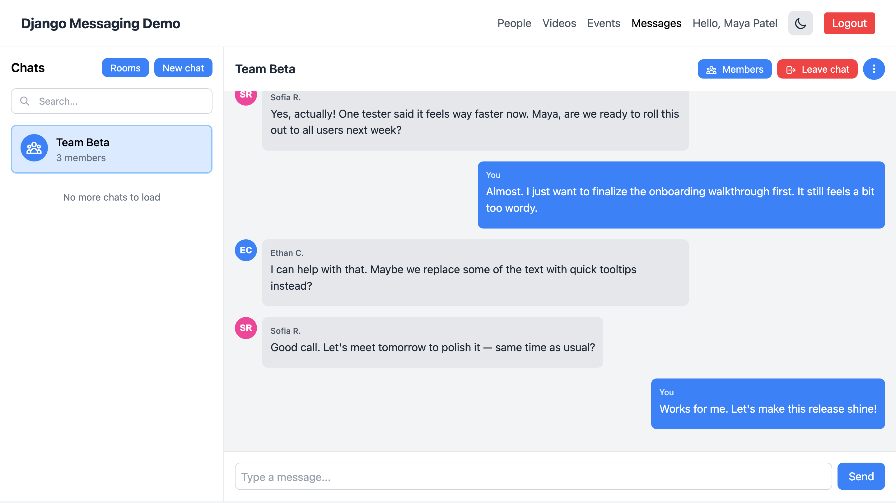
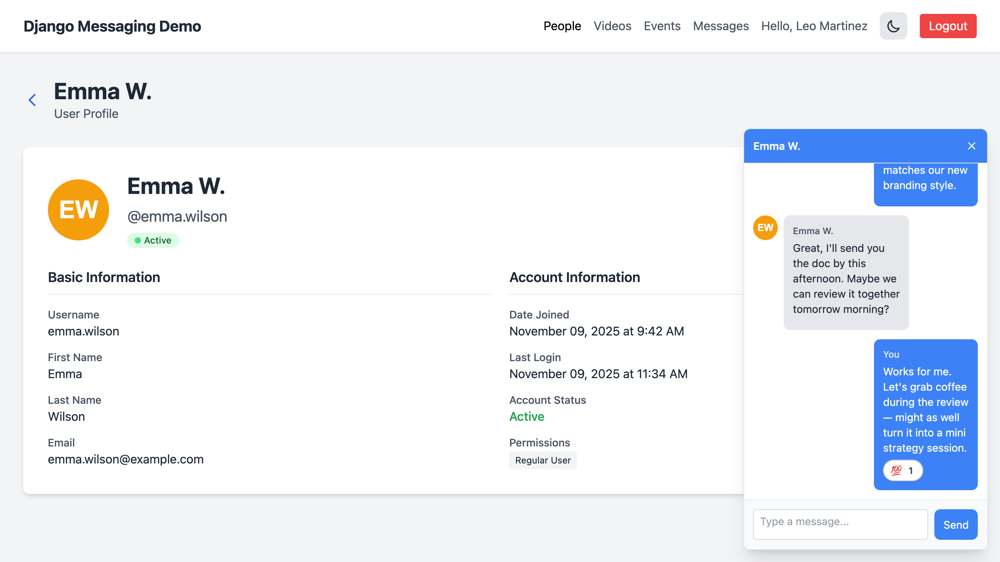
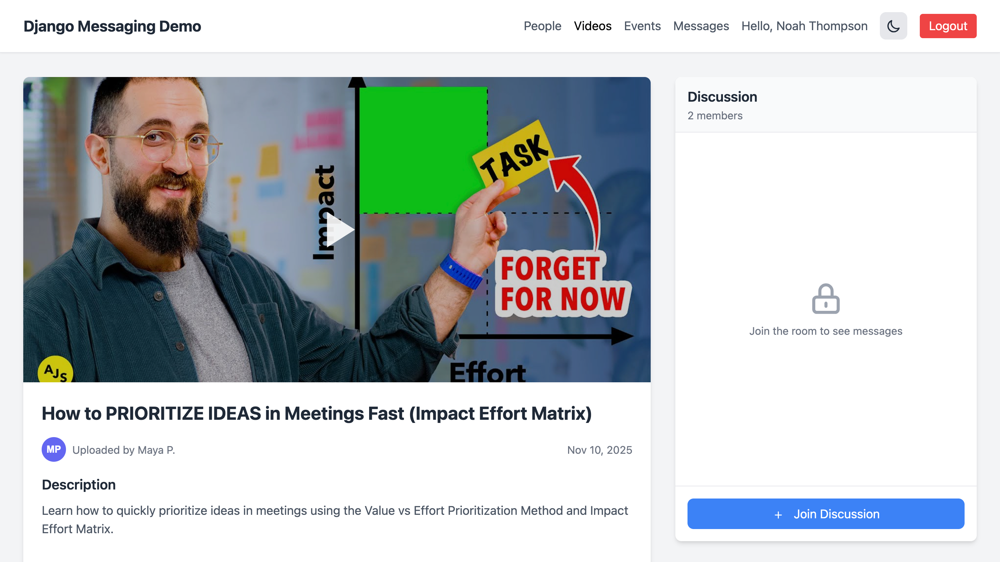
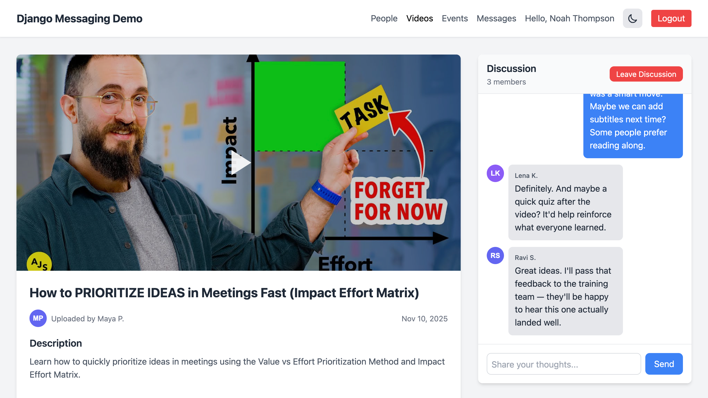

# Django Messaging Demo Project

A demonstration project showcasing the features and capabilities of Django Messaging - a lightweight, extensible Django app for real-time private messaging.

## Overview

This demo project provides a fully functional example of Django Messaging integration, including:

- Real-time direct messaging (DMs) between users
- Group chats with member management
- Chat rooms attached to content objects
- Message reactions, editing, and deletion
- Read receipts and message status tracking
- Both WebSocket and polling transport mechanisms
- Comprehensive frontend tests using Playwright

## Demo

Messages page (all chats in one place)

- Browse all your DMs, group chats, and room conversations from a single Messages view
- Unread badges, typing indicators, and per-message status (sent, delivered, read)
- Emoji reactions, edit and delete your own messages
- Infinite scroll with lazy loading of older messages; the DOM is cleaned up when you scroll back for smooth performance
- Members button is always visible for admins to manage participants
- On small screens, the UI uses two tabs (sidebar and messages); clicking a chat automatically focuses the messages tab



Direct messages (1-on-1 and self-chat)

- Click "New chat" to start a conversation. It creates a self-chat and opens a dialog to add users
- Search people by full name, username, or email
- Press Enter to send messages
- Multiple chats with the same participants are allowed when you need separate threads
- Real-time delivery with WebSocket and a seamless HTTP polling fallback



Chat rooms attached to content (not joined yet)

- Rooms can be embedded next to any object (e.g., videos, articles) and display the conversation even before joining
- Users must join to post messages or reactions; non-members can still read if allowed
- Integrates with your templates via a reusable include and the get_room_for_object template tag



Participating in a room (after joining)

- Once joined, you can send messages, add/remove reactions, and see read receipts
- Reactions and messages are broadcast to all room participants in real-time



## Quick Start

### Prerequisites

- Python 3.10 or higher
- Redis (for WebSocket transport)
- Git

### Installation

#### 1. Clone the repository

```bash
git clone https://github.com/websightful/django-messaging-demo-project.git
cd django-messaging-demo-project
```

#### 2. Purchase and download Django Messaging app
[Get Django Messaging from Gumroad.](https://websightful.gumroad.com/l/django-messaging)

Put the `*.whl` file into `private_wheels/` directory.

#### 3. Create and activate a virtual environment

```bash
python -m venv venv
source venv/bin/activate  # On Windows: venv\Scripts\activate
```

#### 4. Install dependencies

```bash
pip install -r requirements.txt
```

#### 5. Install Playwright browsers (for testing)

```bash
playwright install chromium
```

#### 6. Run migrations

```bash
python manage.py migrate
```

#### 7. Create a superuser

```bash
python manage.py createsuperuser
```

#### 8. Create test users (optional, for testing)

```bash
python manage.py shell
```

Then in the Python shell:

```python
from django.contrib.auth import get_user_model
User = get_user_model()

# Create test users
User.objects.create_user(username='alice', password='testpass123', email='alice@test.com', first_name='Alice', last_name='Smith')
User.objects.create_user(username='bob', password='testpass123', email='bob@test.com', first_name='Bob', last_name='Jones')
User.objects.create_user(username='charlie', password='testpass123', email='charlie@test.com', first_name='Charlie', last_name='Brown')
exit()
```

### Running the Demo

#### Option 1: WebSocket Transport (Default)

**Start Redis:**

```bash
# Using Docker
docker run -p 6379:6379 -d redis:latest

# Or using Homebrew on macOS
brew services start redis

# Or run manually
redis-server
```

**Start the development server:**

```bash
python manage.py runserver
```

#### Option 2: Polling Transport

If you prefer to use HTTP polling instead of WebSockets (no Redis required):

1. Edit `demo_project/settings.py` and set:

```python
DJANGO_MESSAGING = {
    "TRANSPORT": "polling",
}
```

2. Start the development server:

```bash
python manage.py runserver
```

### Access the Application

1. Open your browser and navigate to `http://127.0.0.1:8000/`
2. Log in with your superuser or test user credentials
3. Navigate to `http://127.0.0.1:8000/messages/` to access the messaging interface

## Testing the Features

### Manual Testing

1. **Direct Messages:**
   - Click "New chat" button
   - Search for a user and add them
   - Send messages and see real-time delivery
   - Try adding emoji reactions
   - Edit and delete your own messages

2. **Group Chats:**
   - Create a new chat and add multiple users
   - Test member management (add/remove members)
   - Rename the chat (if you're an admin)

3. **Chat Rooms:**
   - Navigate to any page with embedded chat rooms
   - Test messaging within the context of content objects

### Automated Testing with Pytest

The demo project includes comprehensive Playwright-based frontend tests.

#### Run All Tests

```bash
pytest demo_project/tests/ -v -m frontend
```

#### Run Polling Tests Only

```bash
pytest demo_project/tests/ -v -m "frontend and not websocket"
```

#### Run WebSocket Tests Only

**Prerequisites:** Make sure Redis is running

```bash
pytest demo_project/tests/ -v -m "frontend and websocket"
```

#### Run Specific Test Files

```bash
# DM tests with polling
pytest demo_project/tests/test_dm_frontend_polling.py -v

# DM tests with WebSocket
pytest demo_project/tests/test_dm_frontend_websocket.py -v

# Messages page tests
pytest demo_project/tests/test_messages_frontend_polling.py -v

# Chat room tests
pytest demo_project/tests/test_room_frontend_polling.py -v
```

#### Run Tests with Visible Browser

All tests are configured to run in headed mode with slow motion for better visibility:

```bash
pytest demo_project/tests/test_dm_frontend_polling.py -v -s
```

This will:
- Show browser windows during test execution
- Add 500ms delay between actions
- Include visual pauses for observation

## Project Structure

```
django-messaging-demo-project/
├── demo_project/           # Main Django project
│   ├── settings.py        # Project settings
│   ├── urls.py            # URL configuration
│   ├── asgi.py            # ASGI configuration for WebSocket
│   └── tests/             # Frontend tests
│       ├── conftest.py    # Pytest configuration
│       ├── test_dm_frontend_polling.py
│       ├── test_dm_frontend_websocket.py
│       ├── test_messages_frontend_polling.py
│       └── test_room_frontend_polling.py
├── manage.py              # Django management script
├── requirements.txt       # Python dependencies
└── pytest.ini            # Pytest configuration
```

## Configuration

The demo project uses the following Django Messaging settings:

```python
DJANGO_MESSAGING = {
    "TRANSPORT": "websocket",  # or "polling"
    "MESSAGES_PER_PAGE": 50,
    "CHATS_PER_PAGE": 10,
    "SHOW_DELETED_MESSAGE_INDICATORS": True,
    "ENABLE_CHAT_ROOMS": True,
    "ENABLE_DMS": True,
    "ALLOW_EDITING_OWN_MESSAGES": True,
    "ALLOW_DELETING_OWN_MESSAGES": True,
    "ALLOW_ADDING_REACTIONS": True,
}
```

See the [full documentation](https://websightful.github.io/django-messaging-docs/) for all available settings.

## Learn More

- **Documentation:** https://websightful.github.io/django-messaging-docs/
- **Purchase Django Messaging:** https://websightful.gumroad.com/l/django-messaging
- **Support:** https://www.djangotricks.com/feedback/

## License

This demo project is provided as-is for demonstration purposes. Django Messaging itself is licensed under the MIT License.

